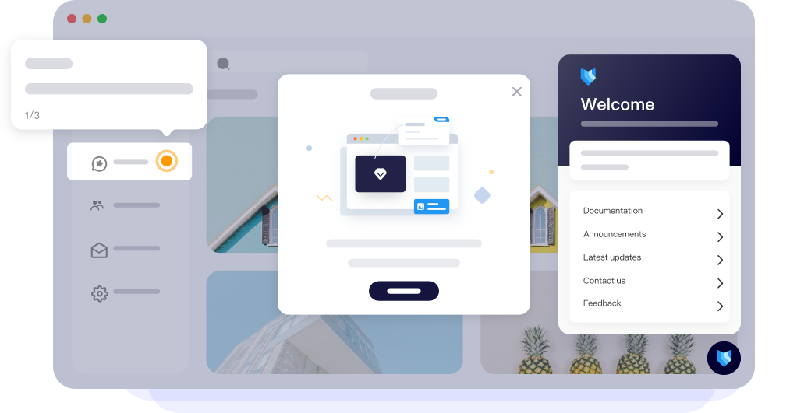

<a href="https://www.usertour.io"></a>

<div align="center">
  <h1 align="center">
    
  </h1>
  <a href="https://www.usertour.io">Usertour</a>: An alternative to: Appcues, Userpilot, Userflow, Userguiding, Chameleon , Etc...<br /><br />
  <p>Usertour is an open-source user onboarding platform designed for developers. It allows you to create in-app product tours, checklists, and launchers in minutes—effortlessly and with full control.</p>
</div>
<p align="center">
  <a target="_blank" href="https://www.usertour.io">Website</a> | <a target="_blank" href="https://www.usertour.io/docs">Documentation</a> | <a target="_blank" href="https://www.usertour.io/blog/">Blog</a> | <a target="_blank" href="https://x.com/usertourio">Twitter</a> | <a target="_blank" href="https://discord.com/invite/Q57psZap">Discord</a>
</p>
<p align="center">
    <a href="https://www.usertour.io" target="_blank">
        </a>
    <a href="https://www.usertour.io/pricing" target="_blank">
        </a>
    <a href="https://discord.com/invite/Q57psZap" target="_blank">
        </a>
    <a href="https://x.com/usertourio" target="_blank">
        </a>
</p>

## Quick Start
### Self-deploy with Docker
Deploy your own feature-rich, unlimited version of Usertour using Docker. 

To start deployment:
```bash
cp .env.example .env # make sure all required envs are properly set
docker compose up -d
```
Visit http://localhost:8000 to start using Usertour.

### Local Development
View details in [Self-hosting](https://www.usertour.io/docs/self-hosting/self-hosting/).

## Features

Usertour makes it easy to design in-app product tours, checklists, launchers, and surveys, enabling anyone to craft effective onboarding experiences. Our team is dedicated to consistently improving Usertour with frequent updates that include new features, bug fixes, and performance enhancements.  

### Effortless integration with any web application  

- 🌐 **Compatible with all frameworks**: If your app runs in a browser, it seamlessly integrates with Usertour.  
- 📄 **Supports multi-page apps**: Whether it's a single-page application or spans across multiple pages, Usertour fits perfectly.  
- 🎯 **Advanced user targeting**: Define custom user attributes and track events to segment and engage your audience effectively.  
<p align="center">
  <video src="https://github.com/user-attachments/assets/97fe8e32-52b3-40f0-864c-bc629352e632" width="100%" />
</p>

### Built for professional workflows with version control and environments  

- 🛠️ **Multiple environments supported**: Manage environments like Production and Staging within a single Usertour account.  
- 🔄 **Version tracking**: Monitor every change in your flows, including who made adjustments and when.  

<p align="center">
  <video src="https://github.com/user-attachments/assets/20da9560-3b32-44a9-822d-747a137f9d2d" width="100%" />
</p>

### Fully customizable appearance  

- 🎨 **Tailor your design**: Adjust text, button colors, font family, and size to match your branding.  
- 🖌️ **Support for multiple themes**: Create unique themes for different flows, offering flexibility for varied use cases.  

<p align="center">
  <video src="https://github.com/user-attachments/assets/7538af6c-185a-485c-a560-fa98efaa4529" width="100%" />
</p>

### Gain actionable insights with powerful analytics  

- 📊 **Performance metrics**: Track the effectiveness of your flows with detailed data on views and completion rates.  
- 🚨 **Identify problem areas**: Pinpoint steps causing user confusion or drop-offs and address the issues seamlessly.  

<p align="center">
  <video src="https://github.com/user-attachments/assets/ada64b91-5010-417e-9979-13e07f0036da" width="100%" />
</p>


## How to Use?
- **Cloud**
  - We've deployed a Usertour Cloud version that allows zero-configuration usage, offering all capabilities of the self-hosted version. Visit [https://www.usertour.io/](https://www.usertour.io/) to get started.
- **Self-hosting Usertour Community Edition**
  - Get started quickly with our [Self-hosting Guide](https://www.usertour.io/docs/self-hosting/self-hosting/) to run Usertour in your environment. For more detailed references and in-depth instructions, please refer to our documentation.
- **Usertour for enterprise / organizations**
  - Please contact us at [support@usertour.io](mailto:support@usertour.io) for private deployment solutions.


## Contributing Guidelines

| Bug Reports                                                              | Feature Requests                                                  | Issues/Discussions                                                       | Usertour Community                                                     |
| ------------------------------------------------------------------------ | ----------------------------------------------------------------- | ------------------------------------------------------------------------ | --------------------------------------------------------------------- |
| [Create Bug Report](https://github.com/usertour/usertour/issues/new/choose) | [Submit Feature Request](https://github.com/usertour/usertour/pulls) | [View GitHub Discussions](https://github.com/usertour/usertour/discussions) | [Visit Usertour Community](https://www.usertour.io/docs/faq) |
| Something isn't working as expected                                      | Ideas for new features or improvements                            | Discuss and raise questions                                              | A place to ask questions, learn, and connect with others              |

Calling all developers, testers, tech writers and more! Contributions of all types are more than welcome, please feel free to browse our [GitHub issues](https://github.com/usertour/usertour/issues) to show us what you can do.

For bug reports, feature requests, and other suggestions, you can also [create a new issue](https://github.com/usertour/usertour/issues/new/choose) and choose the most appropriate template to provide feedback.

If you have any questions, feel free to reach out to us. One of the best places to get more information and learn is the [Usertour Community](https://discord.com/invite/Q57psZap), where you can connect with other like-minded individuals.

## Community and Contact

- [GitHub Discussion](https://github.com/usertour/usertour/discussions): Best for sharing feedback and asking questions.
- [GitHub Issues](https://github.com/usertour/usertour/issues): Best for reporting bugs and suggesting features when using Usertour. Please refer to our contribution guidelines.
- [Discord](https://discord.com/invite/Q57psZap): Best for sharing your applications and interacting with the community.
- [X(Twitter)](https://x.com/usertourio): Best for sharing your applications and staying connected with the community.

## Security Issues

To protect your privacy, please avoid posting security-related issues on GitHub. Instead, send your questions to [support@usertour.io](mailto:support@usertour.io), and we will provide you with a more detailed response.

## License

Usertour is open-source under the GNU Affero General Public License v3.0 (AGPL-3.0), you will find more information about the license and how to comply with it [here](./LICENSE)
